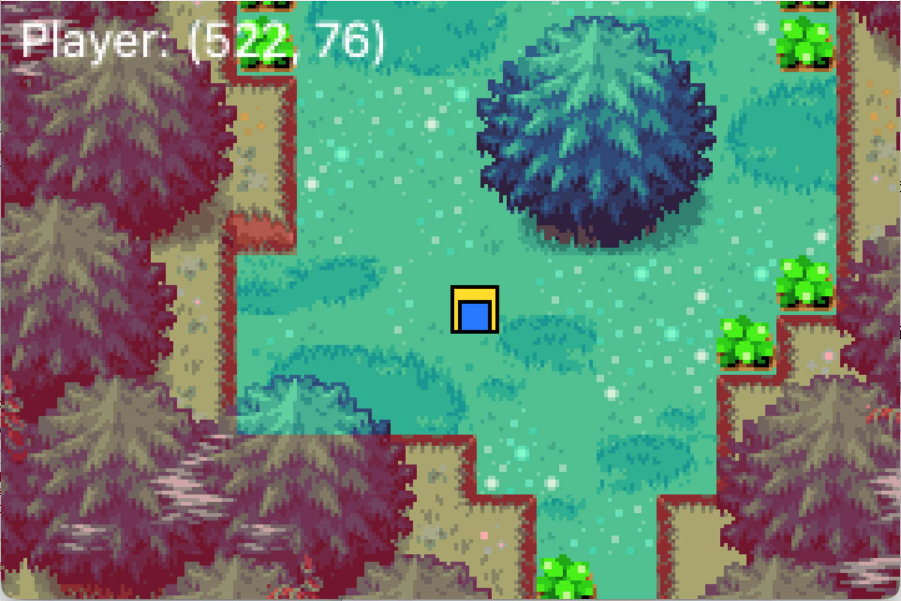
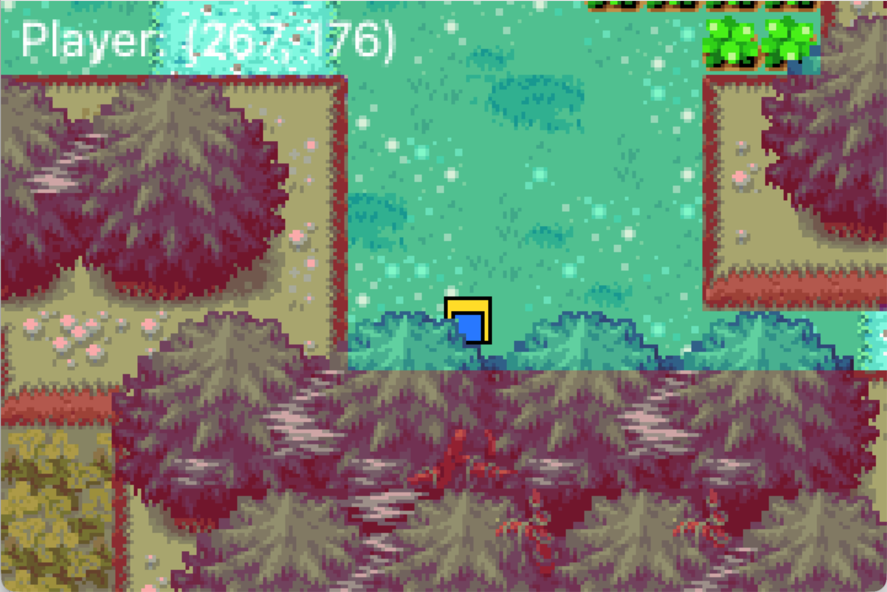

# The Legend of Zelda: The Minish Cap Lite

> 基于 **Qt / C++** 开发的课程大作业项目  
> 以经典作品 **《塞尔达传说：缩小帽》** 为灵感制作的 Lite 版本

---

## 项目背景

《塞尔达传说：缩小帽》是一部经典的解密游戏作品，其精致的场景设计、流畅的角色动作、富有创意的缩小机制以及优秀的交互体验，给许多玩家留下了深刻印象。

本项目以《塞尔达传说：缩小帽》为灵感来源，尝试在课程大作业中使用 **Qt / C++** 实现一个轻量化的 Lite 版本。由于课程时间和个人开发能力有限，本项目并不追求对原作的完整复刻，而是希望通过实现其中具有代表性的基础功能，学习并实践 2D 游戏开发中的核心模块设计。

通过本项目，将原作中的部分玩法机制拆分为可逐步完成的小目标，例如角色移动、地图显示、摄像头跟随、碰撞检测、基础道具系统、背包系统以及缩小后的地图切换等内容，并以版本迭代的方式不断完善。

---

## 项目目标

本项目计划逐步实现以下内容：

- 角色在地图中的基础移动
- 地图显示与场景滚动
- 摄像头随角色移动
- 地图边界限制
- 基础碰撞检测
- 更接近原作的行走效果
- 基础道具效果（如剑、盾等）
- 背包系统
- 缩小功能
- 缩小后切换地图效果

当前阶段希望先完成游戏原型的核心结构，再逐步补充交互、动画、道具与场景切换等功能，使项目从基础演示版本不断向更完整的 Lite 版本推进。

---

## 项目意义

本项目不仅是一次课程大作业实践，也是一次对游戏程序设计与图形界面开发能力的综合训练。

通过本项目，可以系统练习和理解以下内容：

- 使用 **Qt** 进行图形界面开发
- 使用 **C++** 进行模块化程序设计
- 角色坐标控制与场景渲染
- 摄像头跟随逻辑的实现
- 地图边界与碰撞检测的设计
- 道具系统与背包系统的功能拆分
- 游戏功能的版本迭代与逐步完善

同时，本项目也强调开发过程的记录与展示。通过 GitHub 提交记录和 README 的版本更新，可以更清晰地体现项目从基础框架到逐步完善的实现过程，这对于课程展示和个人总结都有积极意义。

---

## 致敬

本项目灵感来源于经典作品 **《塞尔达传说：缩小帽》**。
今年是塞尔达传说系列40周年，作为课程大作业，本项目希望通过自己的实现方式，向原作致敬：  
致敬其优秀的场景表现、动作设计、交互逻辑以及极具特色的“缩小”创意机制。

由于开发时间、课程要求以及个人能力有限，本项目不会追求对原作的完整复刻，而是以学习、实践和表达热爱为目标，在 Lite 版本中尽可能还原部分核心体验。

---

## 开发环境

| 项目 | 说明 |
|------|------|
| 开发语言 | C++ |
| 开发框架 | Qt |
| 开发工具 | Qt Creator |
| 项目类型 | 课程大作业 / 2D 游戏原型 |

---

## 运行方式

1. 使用 **Qt Creator** 打开项目工程文件  
2. 配置对应的 **Qt Kit**  
3. 编译并运行项目  

> 请确保项目资源文件路径正确，否则可能会影响地图、角色或场景的正常显示。

---

## 更新日志

### v0.1
- 完成项目初始化
- 完成基础工程框架搭建
- 实现地图显示
- 实现角色基础移动与朝向（目前未对角色更换贴图 看不出朝向与动作）
- 实现摄像头基础跟随（基于原版）
- 实现地图碰撞（由于是测试阶段 为方便操作 我将碰撞部分标红 后续版本会去掉）

- ## 项目截图

### v0.2
- 完成项目结构重构
- 实现地图透视效果（如人物穿过树会被树冠遮挡）

- ## 项目截图

### v0.3
- 预留更新内容

### v0.4
- 预留更新内容

---

## 当前说明

当前项目仍处于持续开发阶段，后续将继续围绕以下方向进行完善：

- 优化角色移动手感
- 实现角色行走动画
- 加入剑、盾等基础道具
- 加入背包系统
- 实现缩小功能
- 实现缩小后地图切换
- 优化整体界面与交互表现

---

## 仓库说明

本仓库将持续同步项目开发进度、功能实现情况与版本更新记录。  
后续内容将通过以下方式展示项目开发过程：

- README 更新日志
- GitHub Commit History
- 项目截图与演示内容

---

## 说明

本项目仅用于课程学习、程序设计实践与个人开发记录。  
原作版权归其原版权所有方所有。
